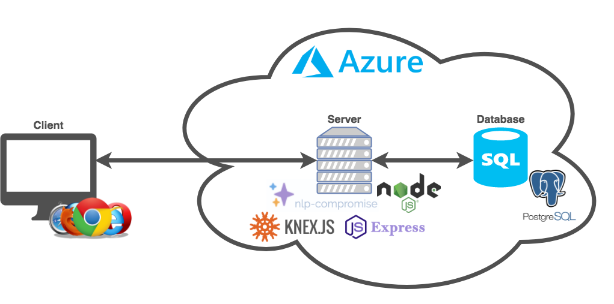

# JS18_ProjectA_Group1 [](https://travis-ci.org/Rostlab/JS18_ProjectA_Group1)

## 1. Project description
TODO-TEAM: project description

## 2. Technical introduction

### 2.1. Code structure
```
.
├── client/
│   ├── index.html                  # Client-side html              
│   ├── js/
│   │   └── app.js                  # Client-side JavaScrip entry
│   ├── scss/
│   │   └── main.scss               # Client-side SCSS entry               
│   ├── test/                  
│   │   ├── karma.conf.js           # Client-side test configuration
│   │   └── unit/                   # Client-side Unit tests  
│   └── public/                     # Compiled client sources
├── server/
│   ├── server.js                   # Express application
│   ├── knexfile.js                 # Knex configuration file
│   ├── .env                        # API keys, passwords, and other sensitive information
│   ├── config/
│   │   └── bookshelf.js            # Bookshelf configuration
│   ├── controllers/                # Express controllers
│   │   ├── classifier.js           # Logic for labeling tokens
│   │   ├── nlp.js                  # Logic for evaluating labeled tokens
│   │   ├── plot-functions.js       # Supported plot functions (get data for input and return plotly object)
│   │   └── public.js               # Provides data for client
│   ├── data/
│   │   ├── core_dataset.csv        # Dataset to plot
│   │   ├── column_synonyms.json    # Synonyms for column names of datasets
│   │   └── commands.json           # Hardcoded commands command specification
│   ├── docs/
│   │   └── api-docs.js             # Swagger-specification file for enpoints
│   ├── librarys/
│   │   └── levensthein_distance.js # Calculates string distance from tokens to labels 
│   ├── migrations/
│   │   └── enployees.js            # Migration that creates the database table
│   └── test/
│       └── unit/                   # Server-side unit tests     
├── documentation/                  # MArkdown files that contain further documentation
├── .travis.yaml                    # Continous integration script
├── gulpfile.js                     # Task definitions
├── knexfile.js                     # Knex configuration
└── package.json                    # NPM Dependencies and scripts
```
### 2.2. Project setup
 1) install node/npm
 2) setup the database (install and configure postgres, example is for mac using homebrew)
 
 (Hint: if you are using the provided dataset make sure the date-format of postgres is mdy)
 
```
# Update Homebrew's package database
$ brew update

# Install PostgreSQL
$ brew install postgres

# Start PostgreSQL Server
$ postgres -D /usr/local/var/postgres
```
 3) create a .env file in the repository root with the following content (change it according to your postgres configuration)
```
DB_HOST="localhost"
DB_USER="postgres"
DB_PASSWORD="postgres"
DB_NAME="postgres"
SESSION_SECRET="testsecret"
```
 4) run the following commands to build the backend and the frontend
```
$ cd <repository>
# Install NPM dependencies
$ npm install

# Build the frontend
$ npm run build
```

### 2.3. Run development server
1) run the following command
```
# Start the app
$ npm run start
  -> Express server listening on port 3000
```
2) visit [http://localhost:3000/]() in the browser

### 2.4. Deployment 
 Currently travis will push the application automatically to azure git repo, which will trigger a deployment. The branches which should be deployed are specified in the .travis.yml . 

 Change .travis.yml file according to your needs. See https://docs.travis-ci.com/user/customizing-the-build for more information

### 2.5. [Dataset handling](documentation/dataset_handling.md)

### 2.6. [Testing](documentation/testing.md)

### 2.7. [NLP Concept](documentation/nlp_concept.md)

### 2.8. [API documentation](documentation/api_doc.md)

## 3. Useful commands
```
# build the system
$ npm run build

# built for production
$ npm run build:production

# start server
$ npm run start

# run local tests
$ npm run test

# automatically build the css while development
$ npm run watch
```

## 4. Links
- [Public demo](https://js2018-group1.azurewebsites.net)
- [API documentation](https://js2018-group1.azurewebsites.net/API/documentation)
